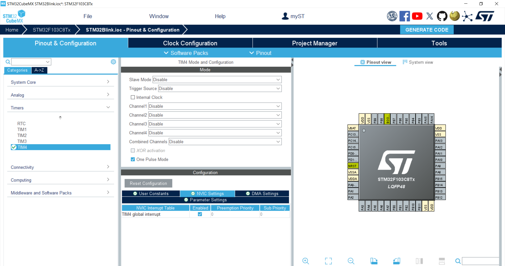
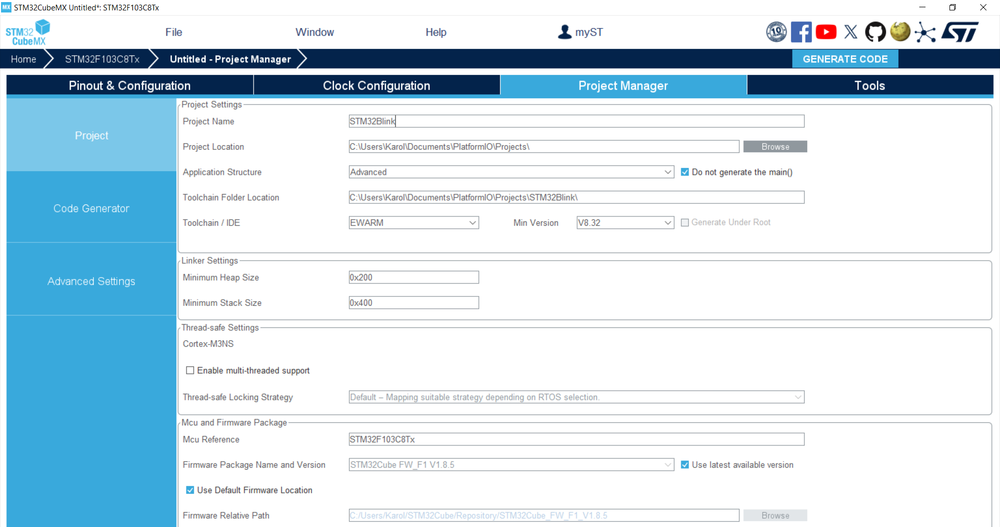
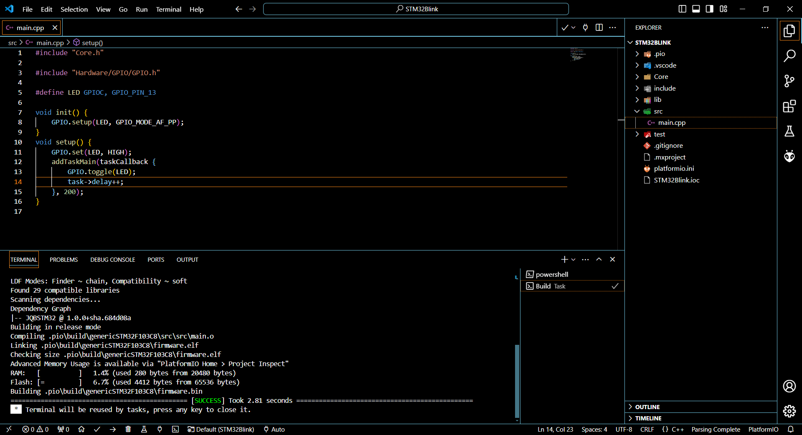

# Przykładowy projekt w języku C++ z wykorzystaniem PlatformIO i STM32CubeMX

## Wymagania wstępne

- STM32CubeMX
- PlatformIO zainstalowane w Visual Studio Code

## Krok 1: Konfiguracja projektu w STM32CubeMX

1. **Uruchom STM32CubeMX**.
2. **Wybierz mikrokontroler**: W naszym przypadku `STM32F103C8Tx`.



3. **Skonfiguruj peryferia**: W naszym przypadku ustawienia dla `TIM4`.



4. **Konfiguracja projektu**:
   - Ustaw nazwę projektu na `STM32Blink`.
   - Wybierz lokalizację projektu.
   - Ustawienie IDE na `EwARM` (lub inne, jeśli jest używane).



5. **Generowanie kodu**:
   - Kliknij `GENERATE CODE` w STM32CubeMX.

## Krok 2: Konfiguracja projektu w PlatformIO

1. **Utwórz nowy projekt** w PlatformIO.
2. **Skonfiguruj plik `platformio.ini`**:
   
```ini
[platformio]
src_dir = ./
include_dir = Core/Inc

[env:genericSTM32F103C8]
platform = ststm32
board = genericSTM32F103C8
framework = stm32cube
lib_deps = 
    https://github.com/JAQUBA/JQBSTM32_Framework.git
build_flags = 
    -DTASK_TIMER=htim4
